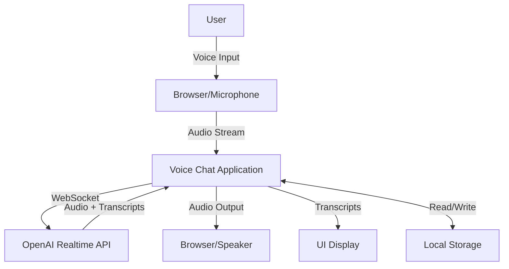

# Design Document

## Overview

The Voice Chat Application is a Next.js-based web application that enables real-time voice conversations with OpenAI's AI assistant using the OpenAI Realtime API. The application captures audio from the user's microphone, streams it to the API via WebSocket, receives audio responses, and plays them back while displaying conversation transcripts. All transcripts are persisted in browser local storage for continuity across sessions.

### Key Features

- Real-time voice conversation with AI assistant
- WebSocket-based audio streaming
- Conversation transcript display with speaker identification
- Local storage persistence for conversation history
- Microphone permission handling
- API key configuration and management
- Audio playback interruption support
- Error handling and user feedback

## Architecture

### High-Level Architecture



### Component Architecture

The application follows a modular React component architecture:

1. **Page Component** (`app/voice-chat/page.tsx`): Main page container
2. **VoiceChatContainer Component**: Orchestrates the voice chat functionality
3. **ConversationDisplay Component**: Renders conversation transcripts
4. **VoiceControls Component**: Provides recording controls and status indicators
5. **ApiKeyDialog Component**: Handles API key input and configuration
6. **useRealtimeAPI Hook**: Manages WebSocket connection and audio streaming
7. **useAudioRecorder Hook**: Handles microphone access and audio capture
8. **useAudioPlayer Hook**: Manages audio playback
9. **useConversationStorage Hook**: Manages local storage operations

## Components and Interfaces

### 1. VoiceChatContainer Component

Main container component that coordinates all voice chat functionality.

**Props:**
```typescript
interface VoiceChatContainerProps {
  className?: string;
}
```

**Responsibilities:**
- Initialize and manage API connection state
- Coordinate between audio recording, playback, and API communication
- Handle API key configuration
- Manage conversation state
- Handle errors and display user feedback

### 2. ConversationDisplay Component

Displays the conversation transcript with speaker identification.

**Props:**
```typescript
interface Message {
  id: string;
  speaker: 'user' | 'assistant';
  text: string;
  timestamp: number;
}

interface ConversationDisplayProps {
  messages: Message[];
  isLoading: boolean;
  onClear: () => void;
}
```

**Responsibilities:**
- Render conversation messages in chronological order
- Distinguish between user and assistant messages
- Show loading indicator during processing
- Provide clear conversation button
- Auto-scroll to latest message

### 3. VoiceControls Component

Provides controls for starting/stopping recording and displays status.

**Props:**
```typescript
interface VoiceControlsProps {
  isRecording: boolean;
  isPlaying: boolean;
  isConnected: boolean;
  onStartRecording: () => void;
  onStopRecording: () => void;
  disabled: boolean;
}
```

**Responsibilities:**
- Display recording button with appropriate state
- Show visual feedback for recording/playing status
- Disable controls when appropriate
- Display connection status

### 4. ApiKeyDialog Component

Modal dialog for API key configuration.

**Props:**
```typescript
interface ApiKeyDialogProps {
  open: boolean;
  onSave: (apiKey: string) => void;
  onCancel: () => void;
}
```

**Responsibilities:**
- Provide secure input field for API key
- Validate API key format
- Save API key to local storage
- Handle cancel action

## Custom Hooks

### useRealtimeAPI Hook

Manages WebSocket connection to OpenAI Realtime API.

**Interface:**
```typescript
interface UseRealtimeAPIOptions {
  apiKey: string;
  onTranscriptReceived: (speaker: 'user' | 'assistant', text: string) => void;
  onAudioReceived: (audioData: ArrayBuffer) => void;
  onError: (error: Error) => void;
}

interface UseRealtimeAPIReturn {
  isConnected: boolean;
  connect: () => Promise<void>;
  disconnect: () => void;
  sendAudio: (audioData: ArrayBuffer) => void;
  interrupt: () => void;
}
```

**Responsibilities:**
- Establish and maintain WebSocket connection
- Handle connection lifecycle (connect, disconnect, reconnect)
- Send audio data to API
- Receive and parse API responses (audio + transcripts)
- Handle interruption signals
- Manage connection errors

**WebSocket Message Format:**
```typescript
// Outgoing - Audio data
interface AudioMessage {
  type: 'input_audio_buffer.append';
  audio: string; // base64 encoded PCM16 audio
}

// Outgoing - Commit audio
interface CommitMessage {
  type: 'input_audio_buffer.commit';
}

// Incoming - Transcript
interface TranscriptMessage {
  type: 'conversation.item.created' | 'response.audio_transcript.delta';
  transcript: string;
  role: 'user' | 'assistant';
}

// Incoming - Audio
interface AudioResponseMessage {
  type: 'response.audio.delta';
  delta: string; // base64 encoded PCM16 audio
}
```

### useAudioRecorder Hook

Handles microphone access and audio capture.

**Interface:**
```typescript
interface UseAudioRecorderOptions {
  onAudioData: (audioData: ArrayBuffer) => void;
  onError: (error: Error) => void;
}

interface UseAudioRecorderReturn {
  isRecording: boolean;
  startRecording: () => Promise<void>;
  stopRecording: () => void;
  hasPermission: boolean | null;
}
```

**Responsibilities:**
- Request microphone permission
- Initialize MediaRecorder or AudioContext
- Capture audio in PCM16 format at 24kHz (OpenAI Realtime API requirement)
- Stream audio data chunks to callback
- Handle recording errors

### useAudioPlayer Hook

Manages audio playback from API responses.

**Interface:**
```typescript
interface UseAudioPlayerOptions {
  onPlaybackEnd: () => void;
}

interface UseAudioPlayerReturn {
  isPlaying: boolean;
  playAudio: (audioData: ArrayBuffer) => void;
  stopAudio: () => void;
  queueAudio: (audioData: ArrayBuffer) => void;
}
```

**Responsibilities:**
- Play audio received from API
- Queue audio chunks for smooth playback
- Handle playback interruption
- Manage audio context and buffer

### useConversationStorage Hook

Manages conversation persistence in local storage.

**Interface:**
```typescript
interface UseConversationStorageReturn {
  messages: Message[];
  addMessage: (speaker: 'user' | 'assistant', text: string) => void;
  clearMessages: () => void;
  loadMessages: () => void;
}
```

**Responsibilities:**
- Load conversation history on mount
- Save messages to local storage
- Clear conversation history
- Handle storage errors gracefully

## Data Models

### Message Model

```typescript
interface Message {
  id: string; // UUID
  speaker: 'user' | 'assistant';
  text: string; // Transcript text
  timestamp: number; // Unix timestamp
}
```

### API Configuration Model

```typescript
interface ApiConfig {
  apiKey: string;
  endpoint: string; // Default: wss://api.openai.com/v1/realtime
  model: string; // Default: gpt-4o-realtime-preview-2024-10-01
}
```

### Connection State Model

```typescript
type ConnectionState = 'disconnected' | 'connecting' | 'connected' | 'error';

interface ConnectionStatus {
  state: ConnectionState;
  error?: string;
}
```

## Error Handling

### Error Types

1. **Microphone Permission Denied**
   - Display user-friendly message explaining permission requirement
   - Provide link to browser permission settings
   - Disable recording controls

2. **WebSocket Connection Failure**
   - Display connection error message
   - Provide retry button
   - Log error details for debugging

3. **API Authentication Error**
   - Display invalid API key message
   - Prompt user to re-enter API key
   - Clear invalid key from storage

4. **Audio Processing Error**
   - Display generic error message
   - Log error details
   - Allow user to retry

5. **Local Storage Error**
   - Display warning about inability to save history
   - Continue with in-memory storage
   - Warn user that history will be lost on refresh

### Error Display Strategy

- Use toast notifications for transient errors
- Use inline error messages for persistent errors
- Provide actionable error messages with clear next steps
- Log all errors to console for debugging

## Testing Strategy

### Unit Tests

1. **Custom Hooks**
   - Test useRealtimeAPI connection lifecycle
   - Test useAudioRecorder permission handling
   - Test useAudioPlayer playback queue
   - Test useConversationStorage CRUD operations

2. **Components**
   - Test VoiceControls button states
   - Test ConversationDisplay message rendering
   - Test ApiKeyDialog validation

### Integration Tests

1. **Audio Pipeline**
   - Test microphone → recorder → API flow
   - Test API → player → speaker flow
   - Test interruption handling

2. **Storage Integration**
   - Test message persistence across component remounts
   - Test clear functionality

3. **Error Scenarios**
   - Test permission denial handling
   - Test connection failure recovery
   - Test invalid API key handling

### Manual Testing Checklist

- [ ] Verify microphone permission prompt appears
- [ ] Verify audio recording starts and stops correctly
- [ ] Verify audio playback is clear and synchronized
- [ ] Verify transcripts appear in real-time
- [ ] Verify conversation persists after page refresh
- [ ] Verify clear conversation functionality
- [ ] Verify interruption stops AI playback
- [ ] Verify error messages display correctly
- [ ] Test on multiple browsers (Chrome, Firefox, Safari)
- [ ] Test on mobile devices

## Security Considerations

1. **API Key Storage**
   - Store in local storage (user-specific, not shared)
   - Warn users not to share their API key
   - Consider adding option to use environment variable for development

2. **Audio Data**
   - Audio is streamed directly to OpenAI, not stored on server
   - Transcripts stored locally only
   - No audio recording saved to disk

3. **HTTPS Requirement**
   - Microphone access requires HTTPS in production
   - WebSocket connection uses WSS (secure WebSocket)

## Performance Considerations

1. **Audio Streaming**
   - Use chunked audio streaming to minimize latency
   - Buffer size: 4096 samples (optimal for real-time)
   - Sample rate: 24kHz (OpenAI requirement)

2. **Transcript Rendering**
   - Use React virtualization for long conversations
   - Limit stored messages to last 100 entries
   - Implement pagination for history view

3. **WebSocket Management**
   - Implement reconnection with exponential backoff
   - Close connection when page is hidden (Page Visibility API)
   - Reopen connection when page becomes visible

## UI/UX Design

### Layout

```
┌─────────────────────────────────────┐
│  Voice Chat with AI Assistant       │
├─────────────────────────────────────┤
│                                     │
│  ┌─────────────────────────────┐   │
│  │  Conversation Transcript    │   │
│  │                             │   │
│  │  User: Hello!               │   │
│  │  Assistant: Hi there! How   │   │
│  │  can I help you today?      │   │
│  │                             │   │
│  │  [Loading...]               │   │
│  └─────────────────────────────┘   │
│                                     │
│  ┌─────────────────────────────┐   │
│  │   [🎤 Start Recording]      │   │
│  │   Status: Connected         │   │
│  │   [Clear History]           │   │
│  └─────────────────────────────┘   │
└─────────────────────────────────────┘
```

### Visual States

1. **Idle State**: Ready to record, button enabled
2. **Recording State**: Red indicator, "Stop Recording" button
3. **Processing State**: Loading spinner, button disabled
4. **Playing State**: Audio wave animation, interrupt enabled
5. **Error State**: Error message with retry button

### Accessibility

- ARIA labels for all interactive elements
- Keyboard navigation support
- Screen reader announcements for state changes
- High contrast mode support
- Focus indicators on all controls

## Implementation Notes

### OpenAI Realtime API Specifics

- **Endpoint**: `wss://api.openai.com/v1/realtime?model=gpt-4o-realtime-preview-2024-10-01`
- **Authentication**: Bearer token in header or query parameter
- **Audio Format**: PCM16, 24kHz, mono, little-endian
- **Protocol**: WebSocket with JSON messages
- **Session Configuration**: Send session.update message after connection

### Browser Compatibility

- Chrome/Edge: Full support
- Firefox: Full support
- Safari: Requires getUserMedia polyfill for older versions
- Mobile browsers: Test microphone access carefully

### Development Environment

- Use HTTPS in development (required for microphone access)
- Consider using ngrok or similar for mobile testing
- Store API key in .env.local for development
