# Reading Practice Feature - Design Specification

## Document Info

| Item | Value |
|------|-------|
| Version | 1.0 |
| Date | 2026-01-22 |
| Status | In Progress |
| Based on | requirements.md v1.0 |

---

## 1. Overview

### 1.1 Feature Summary

AI-powered English reading practice for Japanese learners featuring:
- Adaptive difficulty (CEFR A1-C1)
- Interactive vocabulary lookup with Japanese translations
- Comprehension assessments
- Reading speed tracking

### 1.2 Design Goals

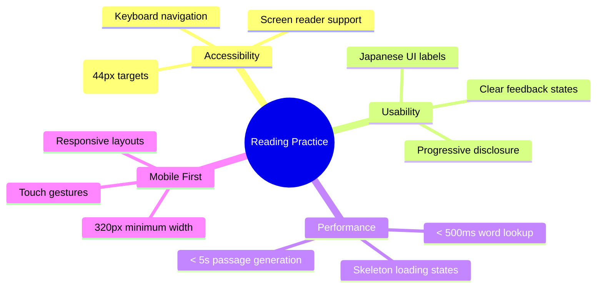

---

## 2. User Flow

### 2.1 Main Reading Flow

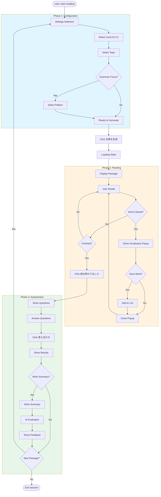

### 2.2 State Machine

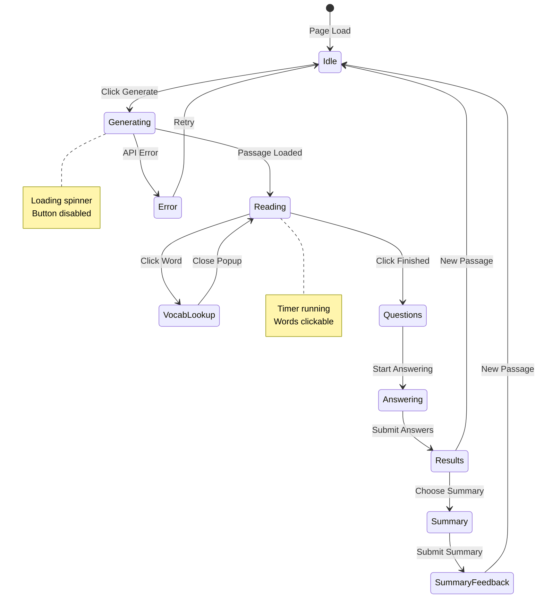

---

## 3. Component Architecture

### 3.1 Component Tree

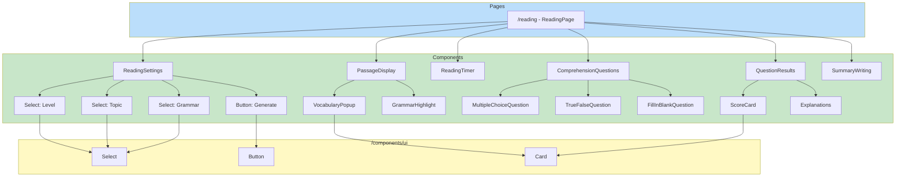

### 3.2 Component Specifications

| Component | Status | File Path | Description |
|-----------|--------|-----------|-------------|
| ReadingSettings | ✅ Done | `components/reading/ReadingSettings.tsx` | Level/topic/grammar selection form |
| PassageDisplay | 📋 Todo | `components/reading/PassageDisplay.tsx` | Renders passage with interactive words |
| VocabularyPopup | 📋 Todo | `components/reading/VocabularyPopup.tsx` | Word definition popup |
| ComprehensionQuestions | 📋 Todo | `components/reading/ComprehensionQuestions.tsx` | Question form |
| QuestionResults | 📋 Todo | `components/reading/QuestionResults.tsx` | Score and explanations |
| ReadingTimer | 📋 Todo | `components/reading/ReadingTimer.tsx` | Reading time tracker |
| SummaryWriting | 📋 Todo | `components/reading/SummaryWriting.tsx` | Summary input and feedback |

---

## 4. Screen Designs

### 4.1 Main Page Layout

```
┌─────────────────────────────────────────────────────────────────┐
│  ← Back                    リーディング練習                      │
├─────────────────────────────────────────────────────────────────┤
│                                                                 │
│  ┌─────────────────────────────────────────────────────────┐   │
│  │  設定                                                    │   │
│  │  難易度とトピックを選んで文章を生成                        │   │
│  ├─────────────────────────────────────────────────────────┤   │
│  │                                                         │   │
│  │  難易度                                                  │   │
│  │  ┌─────────────────────────────────────────────────┐   │   │
│  │  │ A2（初中級）                                  ▼ │   │   │
│  │  └─────────────────────────────────────────────────┘   │   │
│  │                                                         │   │
│  │  トピック                                                │   │
│  │  ┌─────────────────────────────────────────────────┐   │   │
│  │  │ 日常生活                                      ▼ │   │   │
│  │  └─────────────────────────────────────────────────┘   │   │
│  │                                                         │   │
│  │  文法フォーカス（オプション）                             │   │
│  │  ┌─────────────────────────────────────────────────┐   │   │
│  │  │ 選択なし                                      ▼ │   │   │
│  │  └─────────────────────────────────────────────────┘   │   │
│  │                                                         │   │
│  │  ┌─────────────────────────────────────────────────┐   │   │
│  │  │              文章を生成                         │   │   │
│  │  └─────────────────────────────────────────────────┘   │   │
│  │                                                         │   │
│  └─────────────────────────────────────────────────────────┘   │
│                                                                 │
└─────────────────────────────────────────────────────────────────┘
```

### 4.2 Passage Display

```
┌─────────────────────────────────────────────────────────────────┐
│  A Day at the Coffee Shop                                       │
│  ─────────────────────────────────────────────────────────────  │
│  A2 • 230 words • 約2分                                         │
├─────────────────────────────────────────────────────────────────┤
│                                                                 │
│  Sarah woke up early on Saturday morning. She had a busy day    │
│  ahead. First, she went to the local café for breakfast. She    │
│  ordered a cup of coffee and a croissant. The café was quiet,   │
│  and she enjoyed reading the newspaper.                         │
│                                                                 │
│  After breakfast, she walked to the park nearby. The weather    │
│  was perfect for a walk. She saw many people jogging and        │
│  playing with their dogs. Sarah sat on a bench and watched      │
│  the children playing on the swings.                            │
│                                                                 │
│  In the afternoon, Sarah visited her friend's mansion. It       │
│  was a beautiful apartment in the city center. They had tea     │
│  and talked about their plans for the summer vacation.          │
│                                                                 │
├─────────────────────────────────────────────────────────────────┤
│  ⏱️ 読書時間: 2:34                                              │
│  ┌─────────────────────────────────────────────────────────┐   │
│  │              読み終わりました                            │   │
│  └─────────────────────────────────────────────────────────┘   │
└─────────────────────────────────────────────────────────────────┘
```

### 4.3 Vocabulary Popup

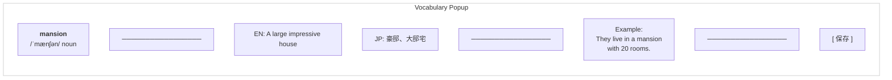

**Popup Design Details:**

```
┌────────────────────────────────────┐
│  mansion                     [×]   │  ← Header with close button
│  /ˈmænʃən/  noun                   │  ← Pronunciation + POS
├────────────────────────────────────┤
│  EN: A large impressive house      │  ← English definition
│  JP: 豪邸、大邸宅                   │  ← Japanese translation
├────────────────────────────────────┤
│  Example:                          │  ← Example sentence
│  "They live in a mansion           │
│   with 20 rooms."                  │
├────────────────────────────────────┤
│  ┌──────────────────────────────┐  │
│  │      単語を保存              │  │  ← Save button
│  └──────────────────────────────┘  │
└────────────────────────────────────┘

Position: Appears near clicked word
Dismissal: Click outside or × button
Width: 280-320px (responsive)
```

### 4.4 Comprehension Questions

```
┌─────────────────────────────────────────────────────────────────┐
│  理解度チェック                                                  │
│  Comprehension Questions                                        │
├─────────────────────────────────────────────────────────────────┤
│                                                                 │
│  Q1. What did Sarah order at the café?                         │
│  ┌─────────────────────────────────────────────────────────┐   │
│  │  ○  Tea and a sandwich                                  │   │
│  │  ●  Coffee and a croissant                              │   │
│  │  ○  Juice and a muffin                                  │   │
│  │  ○  Water and a cookie                                  │   │
│  └─────────────────────────────────────────────────────────┘   │
│                                                                 │
│  Q2. Sarah visited her friend's apartment in the morning.      │
│  ┌─────────────────────────────────────────────────────────┐   │
│  │  ○  True                                                │   │
│  │  ●  False                                               │   │
│  └─────────────────────────────────────────────────────────┘   │
│                                                                 │
│  Q3. Complete: Sarah sat on a _____ and watched the children.  │
│  ┌─────────────────────────────────────────────────────────┐   │
│  │  bench                                                  │   │
│  └─────────────────────────────────────────────────────────┘   │
│                                                                 │
│  ┌─────────────────────────────────────────────────────────┐   │
│  │                    答え合わせ                           │   │
│  └─────────────────────────────────────────────────────────┘   │
│                                                                 │
└─────────────────────────────────────────────────────────────────┘
```

### 4.5 Results Display

```
┌─────────────────────────────────────────────────────────────────┐
│  結果 / Results                                                 │
├─────────────────────────────────────────────────────────────────┤
│                                                                 │
│  ┌─────────────────────────────────────────────────────────┐   │
│  │                                                         │   │
│  │              🎉  3 / 4 正解                             │   │
│  │                  75%                                    │   │
│  │                                                         │   │
│  │   読書速度: 91 WPM  (目標: 80-120 WPM) ✓               │   │
│  │                                                         │   │
│  └─────────────────────────────────────────────────────────┘   │
│                                                                 │
│  ── 解説 ──────────────────────────────────────────────────────  │
│                                                                 │
│  Q1. ✓ 正解                                                    │
│  Coffee and a croissant                                        │
│  解説: 第1段落に "She ordered a cup of coffee and a            │
│  croissant" と書かれています。                                  │
│                                                                 │
│  Q2. ✓ 正解                                                    │
│  False                                                         │
│  解説: Sarahは午後に友人のアパートを訪れました。                  │
│  "In the afternoon, Sarah visited..."                          │
│                                                                 │
│  Q3. ✗ 不正解                                                  │
│  あなたの答え: chair                                           │
│  正解: bench                                                   │
│  解説: "Sarah sat on a bench and watched..."                   │
│                                                                 │
├─────────────────────────────────────────────────────────────────┤
│  ┌───────────────────────┐  ┌───────────────────────┐         │
│  │  要約を書く（任意）   │  │   新しい文章         │         │
│  └───────────────────────┘  └───────────────────────┘         │
└─────────────────────────────────────────────────────────────────┘
```

---

## 5. Data Flow

### 5.1 API Interaction Flow

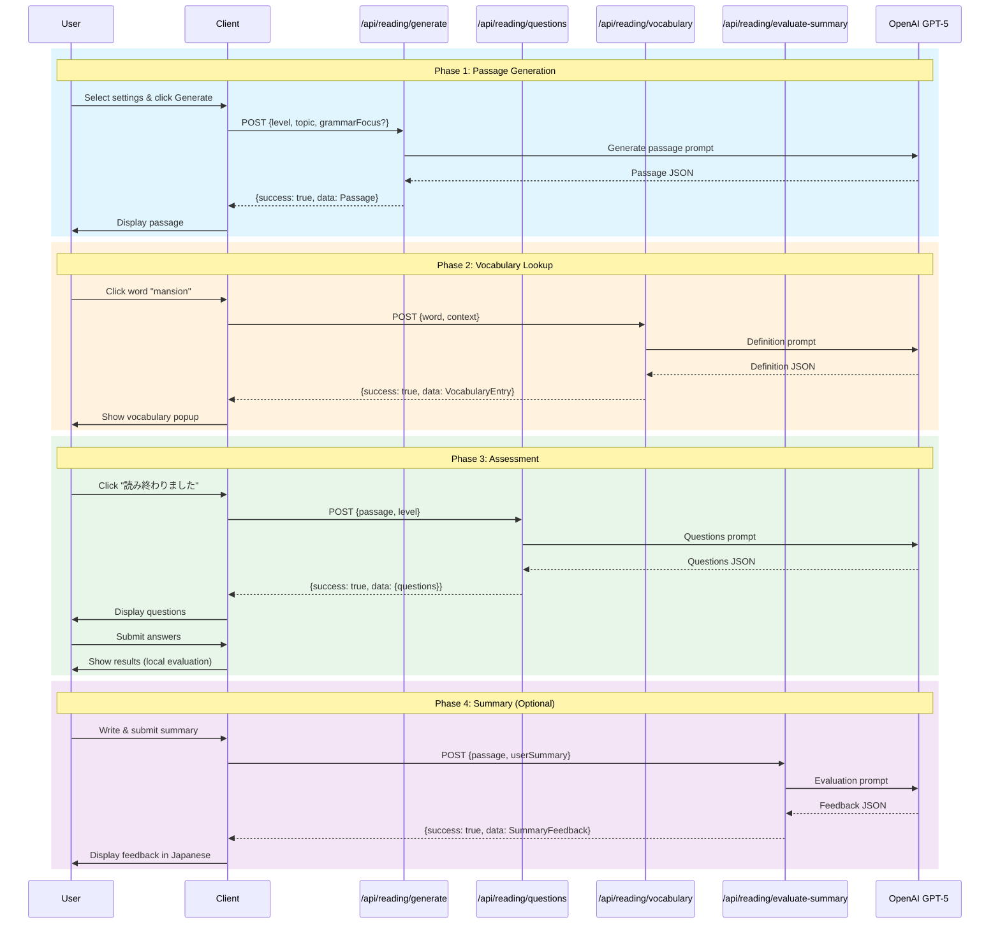

### 5.2 Client State Management

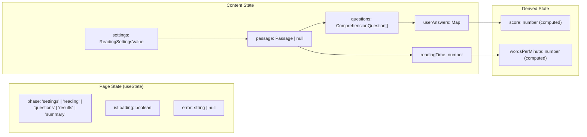

---

## 6. Responsive Breakpoints

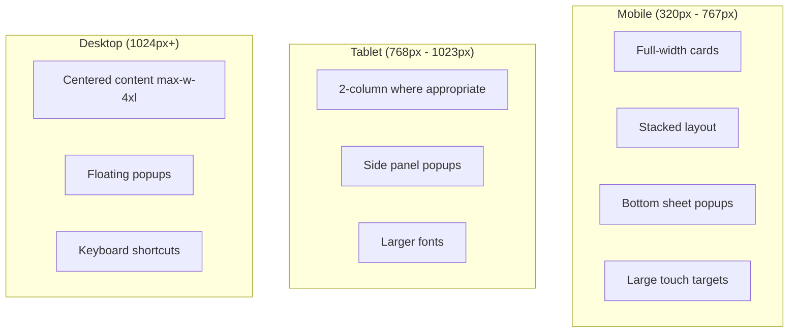

### Layout Specifications

| Breakpoint | Container Width | Font Size Base | Popup Style |
|------------|-----------------|----------------|-------------|
| < 640px | 100% - 32px | 14px | Bottom sheet |
| 640-767px | 100% - 48px | 14px | Bottom sheet |
| 768-1023px | 720px | 16px | Floating |
| 1024px+ | 896px (max-w-4xl) | 16px | Floating |

---

## 7. Accessibility Specifications

### 7.1 Keyboard Navigation

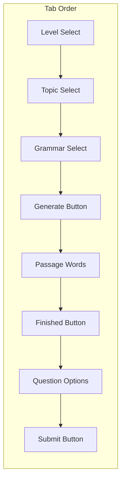

### 7.2 ARIA Labels

| Component | ARIA Label (Japanese) |
|-----------|----------------------|
| Level Select | 難易度を選択 |
| Topic Select | トピックを選択 |
| Grammar Select | 文法フォーカスを選択 |
| Generate Button | 文章を生成 |
| Timer | 読書時間 |
| Score | 正解数 |

### 7.3 Color Contrast

| Element | Foreground | Background | Ratio |
|---------|------------|------------|-------|
| Body text | #1a1a1a | #ffffff | 17.4:1 |
| Secondary text | #6b7280 | #ffffff | 5.0:1 |
| Error text | #dc2626 | #ffffff | 5.9:1 |
| Success text | #16a34a | #ffffff | 4.5:1 |

---

## 8. Loading & Error States

### 8.1 Loading States

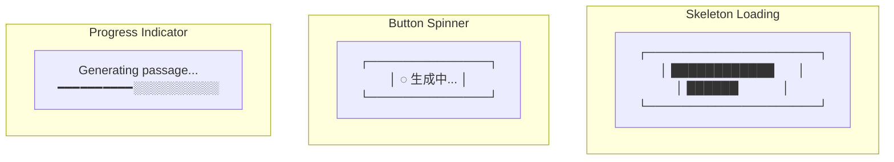

### 8.2 Error States

| Error Type | Japanese Message | Action |
|------------|------------------|--------|
| Network error | ネットワークエラーが発生しました | 再試行ボタン |
| API rate limit | リクエスト制限に達しました。しばらくお待ちください | 待機時間表示 |
| Invalid response | 文章の生成に失敗しました | 再試行ボタン |
| Session timeout | セッションがタイムアウトしました | ページ再読込 |

---

## 9. Animation Specifications

### 9.1 Transitions

| Element | Property | Duration | Easing |
|---------|----------|----------|--------|
| Popup appear | opacity, transform | 150ms | ease-out |
| Popup dismiss | opacity, transform | 100ms | ease-in |
| Button hover | background-color | 150ms | ease |
| Card expand | height | 200ms | ease-in-out |
| Score reveal | scale, opacity | 300ms | spring |

### 9.2 Micro-interactions

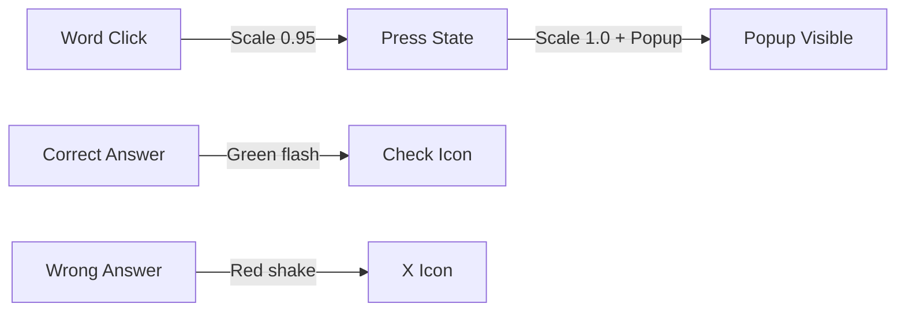

---

## 10. Implementation Priority

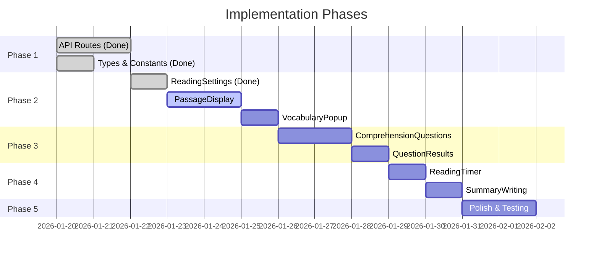

---

## Appendix A: Component Props Reference

### ReadingSettings

```typescript
type ReadingSettingsProps = {
  onSubmit: (settings: ReadingSettingsValue) => void;
  isLoading?: boolean;
  defaultValue?: Partial<ReadingSettingsValue>;
};

type ReadingSettingsValue = {
  level: 'A1' | 'A2' | 'B1' | 'B2' | 'C1';
  topic: 'daily-life' | 'business' | 'travel' | 'news' | 'science' | 'culture';
  grammarFocus?: 'articles' | 'prepositions' | 'present-perfect' |
                 'relative-clauses' | 'passive-voice' | 'conditionals';
};
```

### PassageDisplay

```typescript
type PassageDisplayProps = {
  passage: Passage;
  onWordClick: (word: string, context: string) => void;
  onFinishReading: () => void;
  highlightGrammar?: boolean;
};
```

### VocabularyPopup

```typescript
type VocabularyPopupProps = {
  word: string;
  entry: VocabularyEntry | null;
  isLoading: boolean;
  position: { x: number; y: number };
  onClose: () => void;
  onSave: () => void;
};
```

### ComprehensionQuestions

```typescript
type ComprehensionQuestionsProps = {
  questions: ComprehensionQuestion[];
  onSubmit: (answers: Map<string, Answer>) => void;
  isSubmitting: boolean;
};
```

---

## Appendix B: Color Palette

| Name | Hex | Usage |
|------|-----|-------|
| Primary | #2563eb | Buttons, links |
| Primary Hover | #1d4ed8 | Button hover |
| Success | #16a34a | Correct answers |
| Error | #dc2626 | Wrong answers |
| Warning BG | #fffbeb | Warning background |
| Muted | #6b7280 | Secondary text |
| Border | #e5e7eb | Card borders |

---

*End of Design Specification*
